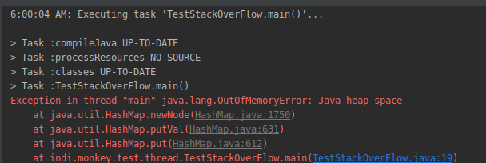
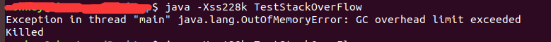
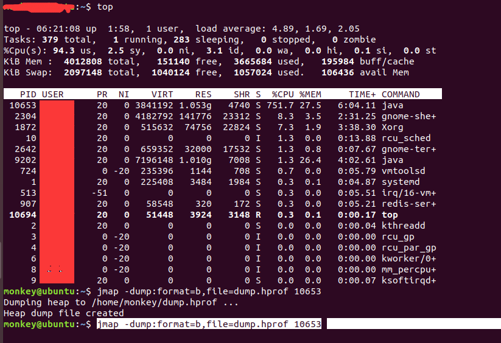

### question:   
&ensp;&ensp;what will happend when a lot of threads have bean created and executed?  
&ensp;&ensp;(ps: each of them will lead to stackoverflow error)  

### test:  
&ensp;&ensp;I want to test in such enviroments...  
&ensp;&ensp;1:ignore the stackoverflow error, make sure others still running or waiting  
&ensp;&ensp;2:put threads into hashmap to make sure they are always hold on references  

###### code here  
```
import java.util.HashMap;
import java.util.Map;
import java.util.concurrent.*;

public class TestStackOverFlow {

    private static void execute(int i) {
        execute(i);
    }

    public static void main(String[] args) {
        ExecutorService executorService = new ThreadPoolExecutor(2, 1000, 1, TimeUnit.SECONDS, new LinkedBlockingDeque<>(), new ThreadPoolExecutor.DiscardPolicy());
        Map<Integer, Runnable> threadMap = new HashMap<>();
        for (int i = 0; i < 100000000000000000l; i++) {
            Runnable r = () -> execute(100);
            threadMap.put(i, r);
            executorService.submit(r);
        }
    }
}  
```

### compile code:  
&ensp;&ensp;javac TestStackOverFlow.java  

### run code:(ps:allocates a small stack memory to make them easy to lead to stackoverflow error, 228k is the least memory size)  
  
&ensp;&ensp;java -Xss228k TestStackOverFlow  

### runing in idea...  
  


### result:  

1:GC overhead limit exceeded  

Killed  



2:memory analyzer...  

2.1:dump heap...(I fergot to dump stack...ah)  
  

2.2:memory analyzer...  
there is something happend that I don't understand...something lead mat to exception...  
obviously! because of heap overflow...sadly! I really don't understand...  
but I got a error log...  

@see  
[error log](../testStatckOverFlow/hs_err_pid11477.log)  

3:To be continue...  

