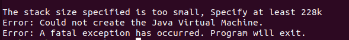

### question: 
&ensp;&ensp;what will happend when a lot of threads have bean created and executed?
&ensp;&ensp;(ps: each of them will lead to stackoverflow error)

### test:
&ensp;&ensp;I want to test in such enviroments...
&ensp;&ensp;1、ignore the stackoverflow error, make sure others still running or waiting
&ensp;&ensp;2、put threads into hashmap to make sure they are always hold on references

###### code here
'''

import java.util.HashMap;
import java.util.Map;
import java.util.concurrent.*;

public class TestStackOverFlow {

    private static void execute(int i) {
        execute(i);
    }

    public static void main(String[] args) {
        ExecutorService executorService = new ThreadPoolExecutor(2, 1000, 1, TimeUnit.SECONDS, new LinkedBlockingDeque<>(), new ThreadPoolExecutor.DiscardPolicy());
        Map<Integer, Runnable> threadMap = new HashMap<>();
        for (int i = 0; i < 100000000000000000l; i++) {
            Runnable r = () -> execute(100);
            threadMap.put(i, r);
            executorService.submit(r);
        }
    }
}
'''

### compile code...
&ensp;&ensp;javac TestStackOverFlow.java

### run code...(ps:allocates a small stack memory to make them easy to lead to stackoverflow error, 228k is the least memory size)

&ensp;&ensp;java -Xss228k TestStackOverFlow

### result:
1、GC overhead limit exceeded
Killed

2、To be continue...
